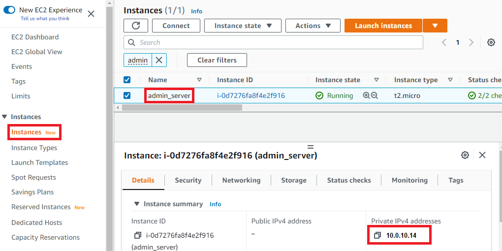
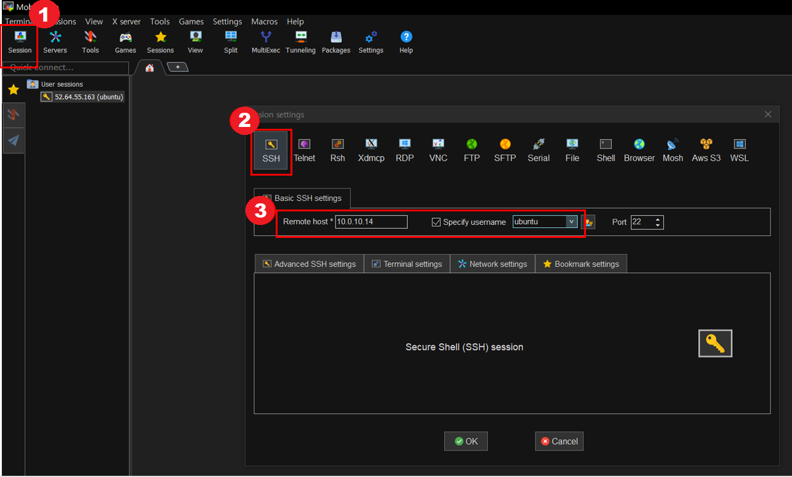
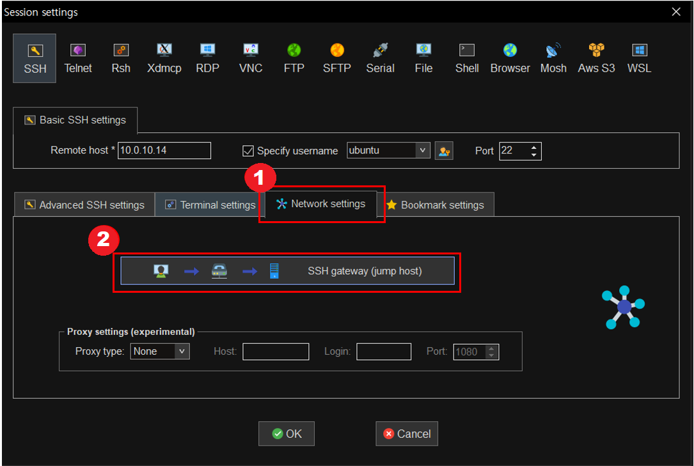
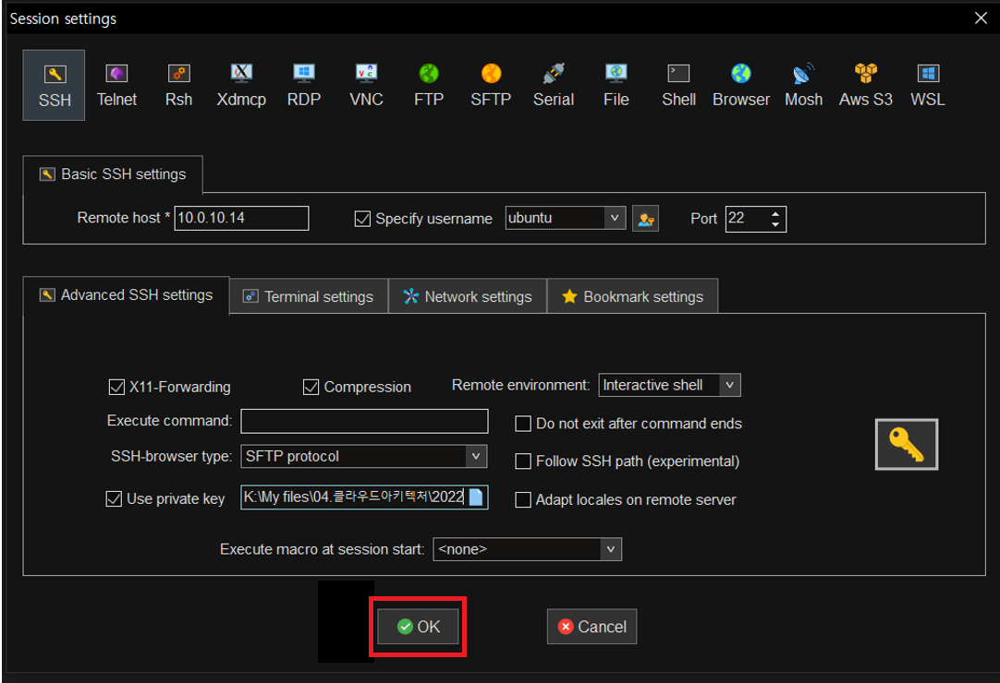
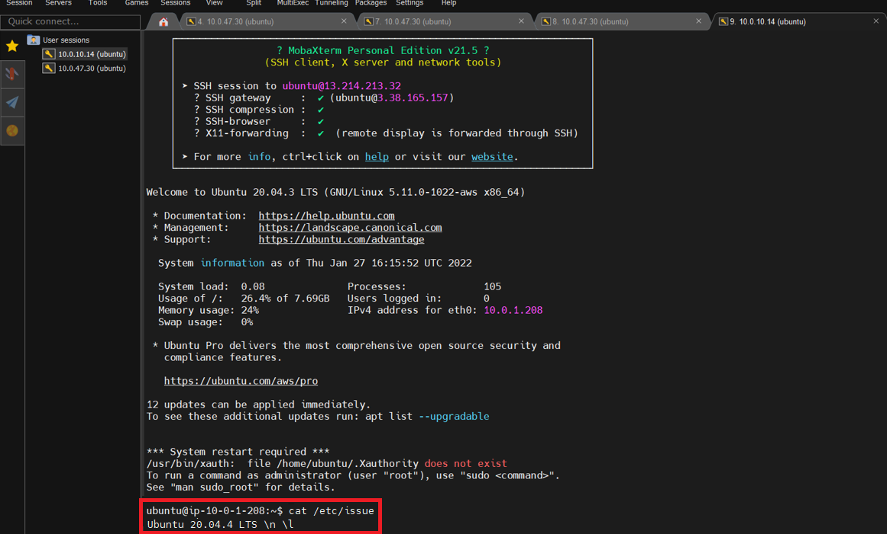

# Management EKS Cluster 생성용 IaC Repository

ⓘ 목적 : 관리용 EKS Cluster / 관리용 Admin Server / 관리용 Bastion Server를 Provisioning 하기위해 IaC를 도입 및 운영에 활용한다.

## IaC Terraform 수행
 - IaC Code 수행내역    
   관리용 VPC 및 Subnet, Route Table, Nat/Internet Gateway 생성 및 설정    
   관리용 EKS Cluster / EKS Node Group 생성 및 설정    
   관리용 Admin Server(kubectl 수행용) 생성, tree, unzip, awscli, terraform, kubectl 설치    
   
<br>

### 1. AWS EC2 **Key Pair**를 생성한다.

- Bastion/Admin Server 접속에 필요한 key 를 생성하고, 해당 key를 다운로드 받아 저장한다.    
- key는 분실에 유의하여 개인 로컬에 관리한다.


> |항목|내용|
> |---|---|
> |➕ Key pair name | `MyKeyPair` 입력 |

<br>

### 2. AWS Region 설정한다.

- 아래 예시는 ap-northeast-2(Seoul) 리젼에서 진행
- 아래 예시는 ap-northeast-2(Seoul) 리젼 내 Ubuntu 20.04 LTS 운영체제    
  AMI ID : ami-0ea5eb4b05645aa8a
- terraform.tfvars

```bash
1 aws_region = "ap-northeast-2"           # 개인이 사용할 리젼으로 변경
2 my_ami     = "ami-0ea5eb4b05645aa8a"    # 개인이 사용할 리젼의 Ubuntu, 20.04 LTS x86 운영체제 AMI ID로 변경
3 my_keypair = "MyKeyPair"                # 변경하지 않고 그대로 사용
```

<br>

### 3. Terraform IaC 실행

- 아래 예시는 ubuntu home 디렉토리 내 ehop-mgmt-IaC git repository를 생성하였다는 가정

<br>

```bash
cd ~/eshop-mgmt-IaC
```
```bash
terraform init
```
```bash
terraform plan
```
```bash
terraform apply
```
<br>

### 4. Argocd 설치

<br>

Argocd Container Install
```bash
kubectl create namespace argocd
```
```bash
kubectl apply -n argocd -f https://raw.githubusercontent.com/argoproj/argo-cd/v2.0.4/manifests/install.yaml
```
```bash
kubectl patch service argocd-server -n argocd -p '{"spec": {"type": "LoadBalancer"}}'
```

<br>

Argocd cli Install
```bash
VERSION=$(curl --silent "https://api.github.com/repos/argoproj/argo-cd/releases/latest" | grep '"tag_name"' | sed -E 's/.*"([^"]+)".*/\1/')
```
```bash
sudo curl --silent --location -o /usr/local/bin/argocd https://github.com/argoproj/argo-cd/releases/download/$VERSION/argocd-linux-amd64
```
```bash
sudo chmod +x /usr/local/bin/argocd
```

<br>

Argocd 초기 Password 확인
```bash
kubectl -n argocd get secret argocd-initial-admin-secret -o jsonpath="{.data.password}" | base64 -d; echo
```
<br>

Argocd endpoint 확인
```bash
kubectl get service -n argocd
```

<br>

### **Admin Server 접속하기**

- Bastion Server를 경유하여 Admin Server에 SSH로 접속하는 실습을 진행한다.

<br>

1. AWS console의 EC2에서 이전에 생성한 admin_server의 Private IPv4 주소와 bastion_server의 Public IPv4 주소를 확인하고 별도로 메모를 해둔다.

📌 **admin_server의 Private IPv4 addresses**를 별도로 메모한다.



<br>

📌 **bastion_server의 Public IPv4 address**를 별도로 메모한다.


<br>


2. ① Mobaxterm 상단의 `Session` 버튼 클릭 → ② 팝업창의 `SSH` 버튼 클릭 → ③ 접속할 admin server 정보 입력

> |항목|내용|
> |---|---|
> |➕ Remote host | 메모한 📌 **Admin Server의 Private IP** 입력 |
> |➕ Specify username | `ubuntu` 입력 (ubuntu OS의 기본 유저는 ubuntu 임) |



<br>

3. ① `Advanced SSH settings` Tab 선택하여 ② `Use private key` 체크박스 클릭 → ③ 아이콘 클릭하여 `MyKeyPair.pem`(admin server 생성 시에 사용하기로 한 pem 파일)을 선택/등록한다.     
- [참고] `MyKeyPair.pem` 파일의 위치는 다운로드시 경로를 변경하지 않았다면 기본적으로 내PC의 다운로드 폴더이다. 


<br>


4. ① `Network settings` 탭 클릭 → ② `SSH gateway(jump host)` 버튼을 클릭한다.

- admin Server 접속 시에 bastion server를 경유하므로, jump host에 bastion server 정보를 등록한다.



<br>

5. ① jump host 정보(bastion server) 입력 후에 ② `OK` 버튼 클릭한다.

> |항목|내용|
> |---|---|
> |➕ Gateway host | 메모한 📌 **Bastion Server의 Public IP** 입력 |
> |➕ Username | `ubuntu` 입력 |
> |➕ Port | `22` 입력 |
> |➕ Use SSH key | 이전에 다운받은 pem 파일(MyKeyPair.pem) 등록 |


<br>

6. 최종적으로 `OK` 버튼 클릭하여 입력정보을 저장한다.



<br>

7. 정상적으로 admin server가 접속되는지 확인한다.

- 접속화면에 `ubuntu@ip-10-0-1-208:~$` 형식의 프롬프트가 보이면 정상적으로 접속된 것이다. IP 정보는 각자 메모한 📌 **admin_server > Private IP**와 동일해야 한다.


<br>

8. 생성된 admin server가 ubuntu 20.04 버전인지 다시 확인한다.

- EC2 서비스에서 OS 버전 정보를 저장하는 /etc/issue 내용으로 확인한다. 
- admin server 에서 `cat /etc/issue` 명령어를 수행해서 버전정보를 확인한다.
  - 🚩 만약 설치된 버전이 Ubuntu 20.04가 아니라면, **기존의 admin server는 삭제**하고 **[1-8. Admin server 생성하기](#1-8-admin-serverec2-생성하기)** 부터 다시 수행해야 한다.



<br>
---