# Management EKS Cluster 생성용 IaC Repository

ⓘ 목적 : 관리용 EKS Cluster / 관리용 Admin Server / 관리용 Bastion Server를 Provisioning 하기위해 IaC를 도입 및 운영에 활용한다.

## IaC Terraform 수행
- 생성되는 인프라 상세 목록 소스코드 분석 및 멘토 제출
   
<br>

### 1. AWS EC2 **Key Pair**를 생성한다.

- Bastion/Admin Server 접속에 필요한 key 를 생성하고, 해당 key를 다운로드 받아 저장한다.    
- key는 분실에 유의하여 개인 로컬에 관리한다.


> |항목|내용|
> |---|---|
> |➕ Key pair name | `MyKeyPair` 입력 |

<br>

### 2. AWS Region 설정한다.

- 아래 예시는 us-east-1 리젼에서 진행
- 아래 예시는 us-east-1 리젼 내 Ubuntu 20.04 LTS 운영체제    
  AMI ID : ami-08d4ac5b634553e16
- terraform.tfvars

```bash
aws_region = "us-east-1"           # 개인이 사용할 리젼으로 변경
my_ami     = "ami-08d4ac5b634553e16"    # 개인이 사용할 리젼의 Ubuntu, 20.04 LTS x86 운영체제 AMI ID로 변경
my_keypair = "MyKeyPair"                # 변경하지 않고 그대로 사용
```

<br>

### 3. Terraform IaC 실행

- 아래 예시는 ubuntu home 디렉토리 내 ehop-mgmt-IaC git repository를 생성하였다는 가정

<br>

```bash
cd ~/eshop-mgmt-IaC
```
```bash
terraform init
```
```bash
terraform plan
```
```bash
terraform apply
```
<br>


### 4. AWS cli를 사용하기 위한 aws configure 설정을 한다.

- 아래 admin server 접속방법 확인 후 생성된 Admin Server EC2에 접속한다.
- 개인 mspmanager IAM계정에 발급된 Access Key 와 Secret Access Key 등록

<br>

```bash
aws configure
```
<br>


### 5. AWS MGMT EKS Cluster 인증정보 획득설정을 진행 한다.

- 아래 admin server 접속방법 확인 후 생성된 Admin Server EC2에 접속한다.

<br>

```bash
aws eks --region=us-east-1 update-kubeconfig --name=eshop-mgmt-eks-cluster --alias=mgmt
```
<br>


### 6. Argocd 설치

- 아래 admin server 접속방법 확인 후 생성된 Admin Server EC2에 접속한다.

<br>

Argocd Container Install
```bash
kubectl create namespace argocd
```
```bash
kubectl apply -n argocd -f https://raw.githubusercontent.com/argoproj/argo-cd/v2.0.4/manifests/install.yaml
```
```bash
kubectl patch service argocd-server -n argocd -p '{"spec": {"type": "LoadBalancer"}}'
```

<br>

Argocd cli Install
```bash
VERSION=$(curl --silent "https://api.github.com/repos/argoproj/argo-cd/releases/latest" | grep '"tag_name"' | sed -E 's/.*"([^"]+)".*/\1/')
```
```bash
sudo curl --silent --location -o /usr/local/bin/argocd https://github.com/argoproj/argo-cd/releases/download/$VERSION/argocd-linux-amd64
```
```bash
sudo chmod +x /usr/local/bin/argocd
```

<br>

Argocd 초기 Password 확인
```bash
kubectl -n argocd get secret argocd-initial-admin-secret -o jsonpath="{.data.password}" | base64 -d; echo
```
<br>

Argocd endpoint 확인
```bash
kubectl get service -n argocd
```

<br>


## 별첨. Jenkins Secret 변경 무시

```yaml
ignoreDifferences:
  - kind: Secret
    jsonPointers:
      - /data/jenkins-admin-password
```

<br>

## 별첨.**Admin Server 접속하기**

- Bastion Server를 경유하여 Admin Server에 SSH로 접속하는 실습을 진행한다.

<br>

1. AWS console의 EC2에서 이전에 생성한 admin_server의 Private IPv4 주소와 bastion_server의 Public IPv4 주소를 확인하고 별도로 메모를 해둔다.

📌 **admin_server의 Private IPv4 addresses**를 별도로 메모한다.


<br>

📌 **bastion_server의 Public IPv4 address**를 별도로 메모한다.


<br>


2. ① Mobaxterm 상단의 `Session` 버튼 클릭 → ② 팝업창의 `SSH` 버튼 클릭 → ③ 접속할 admin server 정보 입력

> |항목|내용|
> |---|---|
> |➕ Remote host | 메모한 📌 **Admin Server의 Private IP** 입력 |
> |➕ Specify username | `ubuntu` 입력 (ubuntu OS의 기본 유저는 ubuntu 임) |


<br>

3. ① `Advanced SSH settings` Tab 선택하여 ② `Use private key` 체크박스 클릭 → ③ 아이콘 클릭하여 `MyKeyPair.pem`(admin server 생성 시에 사용하기로 한 pem 파일)을 선택/등록한다.     
- [참고] `MyKeyPair.pem` 파일의 위치는 다운로드시 경로를 변경하지 않았다면 기본적으로 내PC의 다운로드 폴더이다. 


<br>


4. ① `Network settings` 탭 클릭 → ② `SSH gateway(jump host)` 버튼을 클릭한다.

- admin Server 접속 시에 bastion server를 경유하므로, jump host에 bastion server 정보를 등록한다.


<br>

5. ① jump host 정보(bastion server) 입력 후에 ② `OK` 버튼 클릭한다.

> |항목|내용|
> |---|---|
> |➕ Gateway host | 메모한 📌 **Bastion Server의 Public IP** 입력 |
> |➕ Username | `ubuntu` 입력 |
> |➕ Port | `22` 입력 |
> |➕ Use SSH key | 이전에 다운받은 pem 파일(MyKeyPair.pem) 등록 |


<br>

6. 최종적으로 `OK` 버튼 클릭하여 입력정보을 저장한다.


<br>

7. 정상적으로 admin server가 접속되는지 확인한다.

- 접속화면에 `ubuntu@ip-10-0-1-208:~$` 형식의 프롬프트가 보이면 정상적으로 접속된 것이다. IP 정보는 각자 메모한 📌 **admin_server > Private IP**와 동일해야 한다.


<br>

8. 생성된 admin server가 ubuntu 20.04 버전인지 다시 확인한다.

- EC2 서비스에서 OS 버전 정보를 저장하는 /etc/issue 내용으로 확인한다. 
- admin server 에서 `cat /etc/issue` 명령어를 수행해서 버전정보를 확인한다.


<br>

---

<br>

## 별첨.ArgoCD Password 초기화 가이드     

<br>

ArgoCD의 Password 분실 시 PW를 초기화 할 수 있는 방법이다.

---

<br>
<br>

    
1. 현재 비밀번호 삭제 - admin.password 와 admin.passwordMtime 의 key, value 2라인을 모두 지우고 저장 

<br>

1-1. ArgoCD Credential 관련 설정 변경창 열기    

🧲 (COPY)     
```bash
kubectl edit secret argocd-secret -n argocd
```       
✔ **(수행코드/결과)**  

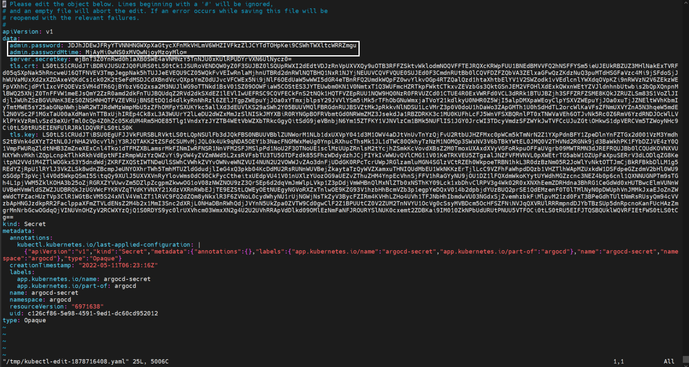     

<br>

1-2. admin.password 및 admin.passwordMtime 두개 Line을 삭제 후 저장한다. (위 그림의 하얀 네모칸 부분)    

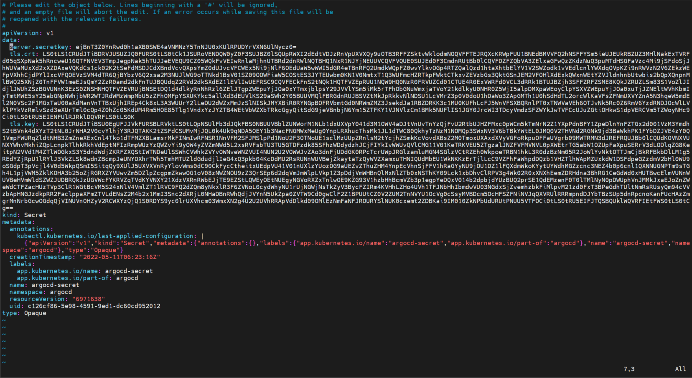     

<br>

2. argocd-server pod 재시작     

<br>

2-1. argocd-server를 prefix로 가진 pod의 id를 파악하여 해당 pod을 삭제한다.(삭제하면 새로운 Pod이 뜨므로 재기동과 마찬가지)

🧲 (COPY)     
```bash
kubectl get pods -n argocd | grep ^argocd-server- | cut -d ' ' -f1 | xargs -I %  kubectl delete pod % -n argocd
```       

✔ **(수행코드/결과)**  

```bash
ubuntu@ip-10-0-11-40:~$ kubectl get pods -n argocd | grep ^argocd-server- | cut -d ' ' -f1 | xargs -I %  kubectl delete pod % -n argocd
pod "argocd-server-86f7f94488-5t7lx" deleted
```       

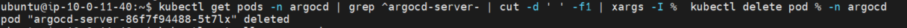        

> 👉 argocd-server-* prefix를 가진 pod이 deleted된 결과 확인.(기존 argocd-server pod이 삭제되고 새로 생성되어 기동됨)        


<br>

3. 기존 pod 삭제 확인 및 신규 pod 생성 확인    

<br>

🧲 (COPY)     
```bash
kubectl get pods -n argocd
```       
✔ **(수행코드/결과)**  

```bash
ubuntu@ip-10-0-11-40:~$ kubectl get pods -n argocd
NAME                                  READY   STATUS    RESTARTS   AGE
argocd-application-controller-0       1/1     Running   0          4h46m
argocd-dex-server-7946bfbf79-wtzgz    1/1     Running   0          4h46m
argocd-redis-7547547c4f-rwzhl         1/1     Running   0          4h46m
argocd-repo-server-6b5cf77fbc-nvm92   1/1     Running   0          4h46m
argocd-server-86f7f94488-lbbbs        1/1     Running   0          4m59s
```       
> 👉 argocd-server-86f7f94488-lbbbs라는 pod이 새로 생성되어 Running 상태가 된 것을 확인할 수 있다.        


4. 새로운 비밀번호 확인      

<br>

4-1. 새로 지정된 ArgoCD의 Password 확인        

🧲 (COPY)     
```bash
kubectl -n argocd get secret argocd-initial-admin-secret -o jsonpath="{.data.password}" | base64 -d; echo
```       
✔ **(수행코드/결과)**  

```bash
ubuntu@ip-10-0-11-40:~$ kubectl -n argocd get secret argocd-initial-admin-secret -o jsonpath="{.data.password}" | base64 -d; echo
qtPgRNqxJDjjlAun
```       


5. 새로운 비밀번호로 ArgoCD Web 접속    

<br>

5-1. argocd 접속 url(endpoint) 확인(아래 명령어 EXTERNAL-IP 결과로 표출)    

🧲 (COPY)     
```bash
kubectl get svc -n argocd
```       
✔ **(수행코드/결과)**  

```bash
ubuntu@ip-10-0-11-40:~$ kubectl get svc -n argocd
NAME                    TYPE           CLUSTER-IP       EXTERNAL-IP                                                                    PORT(S)                      AGE
argocd-dex-server       ClusterIP      172.20.27.136    <none>                                                                         5556/TCP,5557/TCP,5558/TCP   5h4m
argocd-metrics          ClusterIP      172.20.223.52    <none>                                                                         8082/TCP                     5h4m
argocd-redis            ClusterIP      172.20.150.183   <none>                                                                         6379/TCP                     5h4m
argocd-repo-server      ClusterIP      172.20.124.220   <none>                                                                         8081/TCP,8084/TCP            5h4m
argocd-server           LoadBalancer   172.20.236.231   a1647c7b540474c449e1bbf6e01a96f3-2124658133.us-east-1.elb.amazonaws.com   80:31869/TCP,443:31481/TCP   5h4m
argocd-server-metrics   ClusterIP      172.20.148.74    <none>                                                                         8083/TCP                     5h4m
```       
> 👉 위 예시의 경우 "a1647c7b540474c449e1bbf6e01a96f3-2124658133.us-east-1.elb.amazonaws.com" endpoint 확인 후 아래 url로 Chrome으로 접속
"http://a1647c7b540474c449e1bbf6e01a96f3-2124658133.us-east-1.elb.amazonaws.com"


<br>
---

## 별첨.Crontab 명령어

1. Crontab 조회 (ubuntu 계정)

```bash
crontab -l -u ubuntu
```

2. Crontab 편집 (ubuntu 계정)

```bash
crontab -e -u ubuntu
```

2-1. 편집 시 본인이 편한 편집기를 사용할 수 있다. (default vim은 2번)

<br>

# 별첨.Bastion EC2 ssh port customize

<br>

운영 1일차 실습간 Bastion EC2 생성 시 SSH의 기본 포트인 22번 포트의 Outbound가 막혀있는 환경에서의 EC2 생성과 설치 및 접속 세팅을 위한 방법이다.    

설정을 달리해야 할 아래 두 부분과 관련된 가이드만 진행.    

Bastion server 생성하기    
Admin server 접속하기

---

<br>

### ** Bastion server 생성하기**    

- 외부에서 Private subnet으로 접근하기 위한 중계 서버로 public subnet 상에 생성한다.

<br>

1.  AWS EC2 서비스로 이동한다.
   
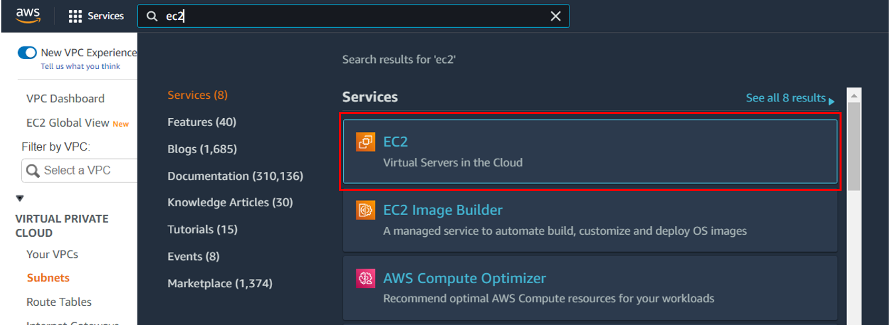

<br>

2. EC2 서비스의 좌측 메뉴에서 `Instances`의 `Launch instances` 버튼을 클릭한다.
   
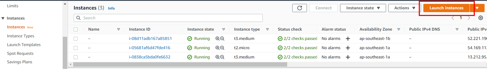

<br>

3. **Name and tags** 작성한다.

- Tag 추가 없이 진행 가능하나, 이후 EC2 식별을 위해 아래와 같이 `Add additional tags` 클릭 후 태그를 추가한다.

➕ Name : bastion_server 입력

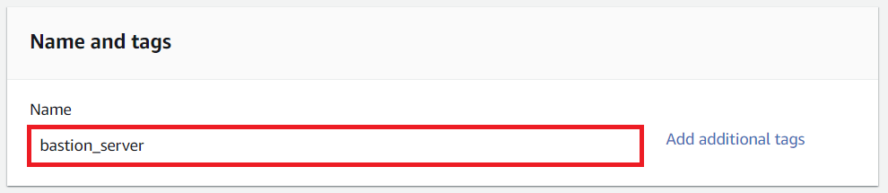


<br>

4. **Application and OS Images (Amazon Machine Image)** 를 선택한다.
 
- Ubuntu 운영체제의  64bit `20.04 LTS` 버전을 선택한다.

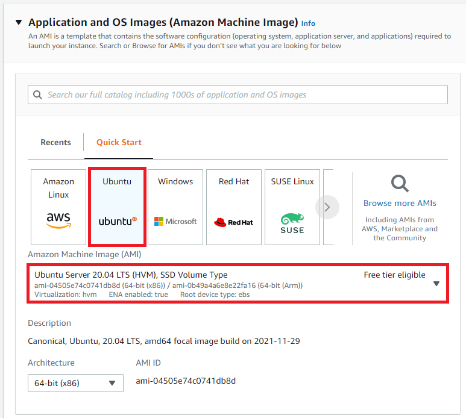

<br>

5. **Instance type**을 선택한다.

- Bastion server 인스턴스 유형은 비용 효율을 위해서 t2.micro를 선택한다.

➕ `t2.micro` 선택


<br>

6. **Key Pair**를 생성한다.

- Bastion Server 접속에 필요한 key 를 생성하고, 해당 key를 다운로드 받아 저장한다.

➕ Key pair name : `MyKeyPair` 입력

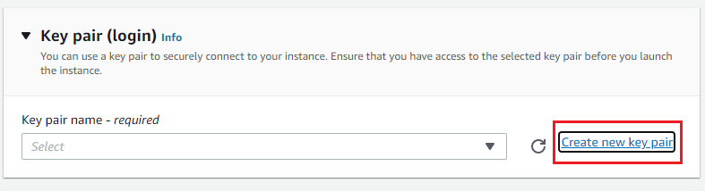


**❗ `Create key pair` 클릭하여 pem 키 다운로드하여 로컬 PC에 저장한다.(분실에 유의)**


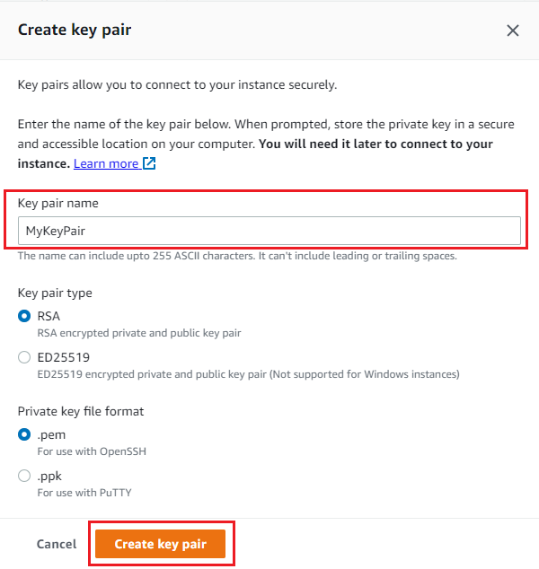

<br>

7. **Network settings**을 설정한다.

우측의 `Edit` 버튼을 클릭하여 이전에 만든 VPC와 public subnet 중 1개를 선택한다.
   
➕ Network : `mgmt-vpc` 선택

➕ Subnet : ❗`mgmt-public-sub01` 선택

➕ Auto-assign Public IP : `Enable` 확인 (안되어 있다면 Enable로 변경)

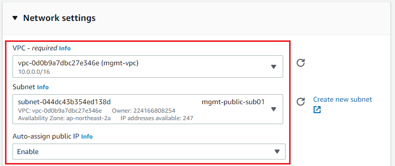

<br>

8. **Create Security group**

- Security group name 및 접근하려는 IP 정보를 입력하여 Bastion Server의 Security Group을 생성한다. (기존 SSH Default 22번 포트가 불필요하므로, 삭제한 후 커스터마이징한 10022포트를 추가한다.)

➕ Assign a security group : `Create a new security group` 선택

➕ Security group name : `bastion-sg-v2` 입력

➕ Security group의 Description : `security group for bastion server` 입력

<br>

👉 **아래의 Rule을 삭제**하기 위해 `Remove` 버튼 클릭


➖ Type : `ssh`

➖ Source Type : `My IP` 

➖ Port range : `22` 

➖ Security group의 Description : `security group for bastion server`    

<br>

👉 **아래의 Rule을 새로 추가**하기 위해 `Add security group rule` 버튼 클릭
   


➕ Type : `Custom TCP` 선택

➕ Source Type : `My IP` 선택

➕ Port range : `10022` 입력

➕ Security group의 Description : `my house(custom port)` 입력

 

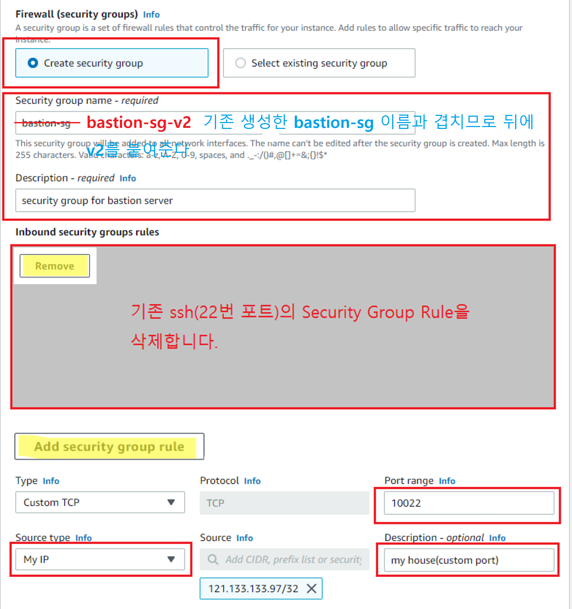

<br>

9. **Configure storage**

- 별도 입력없이 넘어간다.

  
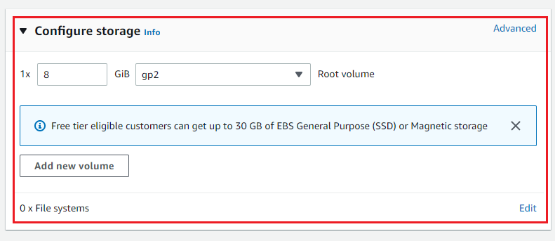

<br>

10. **Configure Advanced details > User data**

Launch Instance 메뉴 중 최 하단의 Advanced details를 펼쳐본다.    

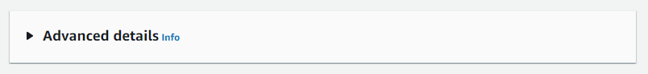

Advanced details 설정 항목 중 나머지 것들은 모두 기본상태로 둔 채로, 상세 내용 중 제일 하단의 `User data` 만을 편집한다.

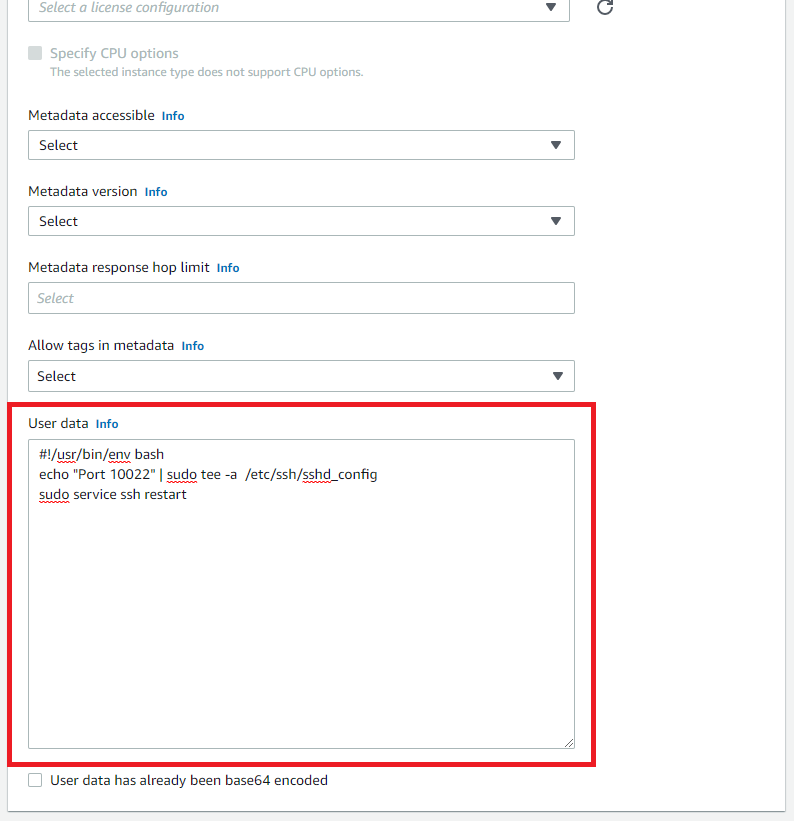

👉 **아래의 User data Script를 추가**

🧲 (COPY) 
```c
#!/usr/bin/env bash
echo "Port 10022" | sudo tee -a  /etc/ssh/sshd_config
sudo service ssh restart
```

<br>

11. 우측 하단의 `Launch Instance` 버튼 클릭으로 bastion_server을 생성한다.

- 정상적으로 생성되었다면 Instances 메뉴의 Instance state 열에 **Running** 이라고 보인다.

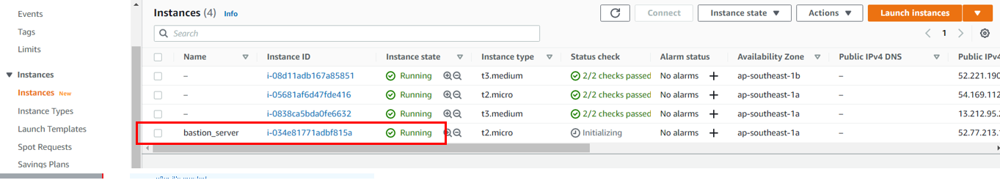

<br>

---

### ** Admin Server 접속하기**

- Bastion Server를 경유하여 Admin Server에 SSH로 접속하는 실습을 진행한다.

<br>

1. AWS console의 EC2 > Security Groups 항목에서 `admin-sg`의 Edit inbound rules 작업을 해준다.

> 기존 엔트리 `bastion-sg`를 삭제하고(X 표시를 누르면 엔트리의 Source가 삭제되고 재설정 가능), 신규 엔트리 `bastion-sg-v2`를 등록해주고 `Save rules`를 누른다.

<br>

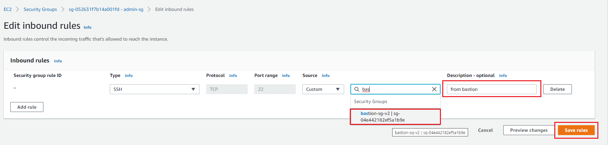


<br>

2. AWS console의 EC2에서 이전에 생성한 admin_server의 Private IPv4 주소와 bastion_server의 Public IPv4 주소를 확인하고 별도로 메모를 해둔다.

📌 **admin_server의 Private IPv4 addresses**를 별도로 메모한다.


<br>

📌 **bastion_server의 Public IPv4 addresses**를 별도로 메모한다.

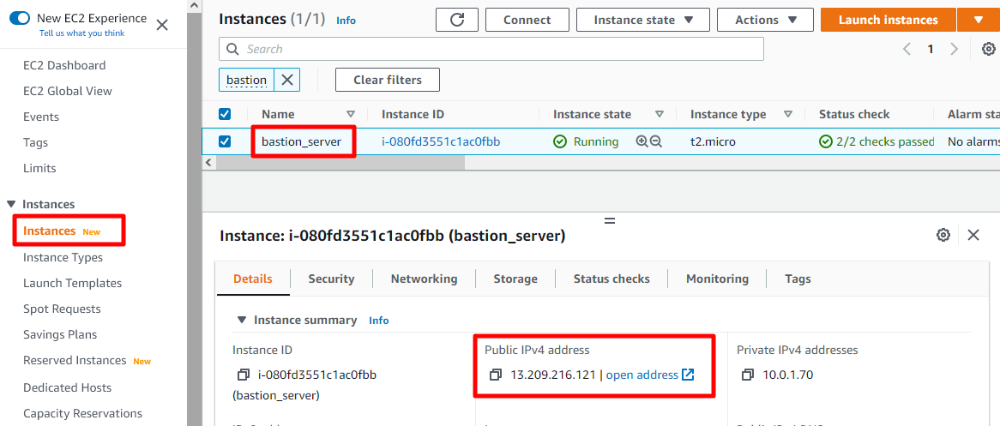

<br>


3. ① Mobaxterm 상단의 `Session` 버튼 클릭 → ② 팝업창의 `SSH` 버튼 클릭 → ③ 접속할 admin server 정보 입력

➕ Remote host : 메모한 📌 **Admin Server의 Private IP** 입력

➕ Specify username : `ubuntu` 입력 (ubuntu OS의 기본 유저는 ubuntu 임)

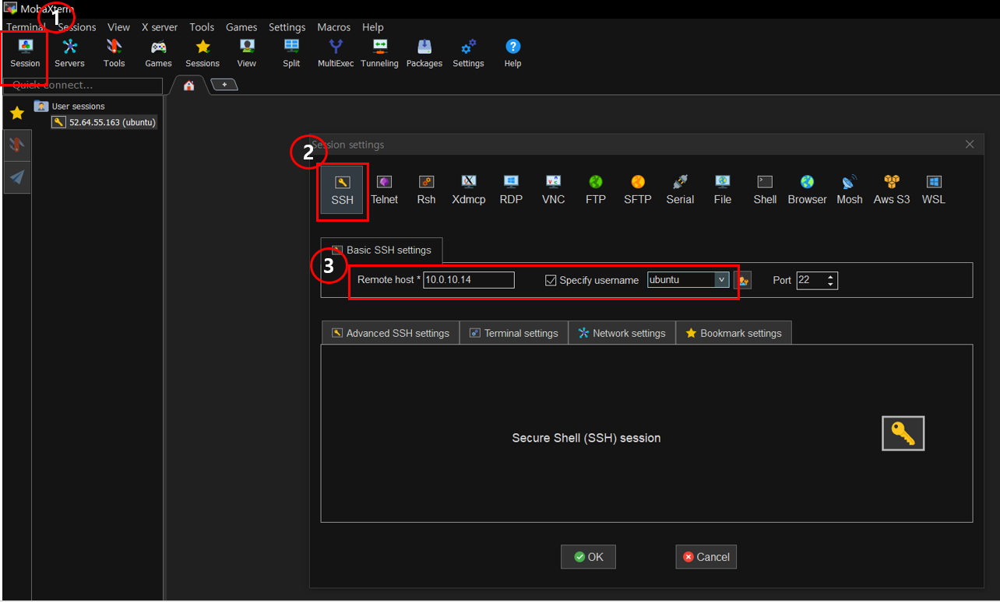

<br>

4. ① Advanced SSH settings Tab의 ② Use private key 선택 → 아래 그림의 표기된 ③ 아이콘 클릭 → admin Server를 생성하는 과정에서 사용하기로 pem 파일(MyKeyPair.pem)을 등록한다.

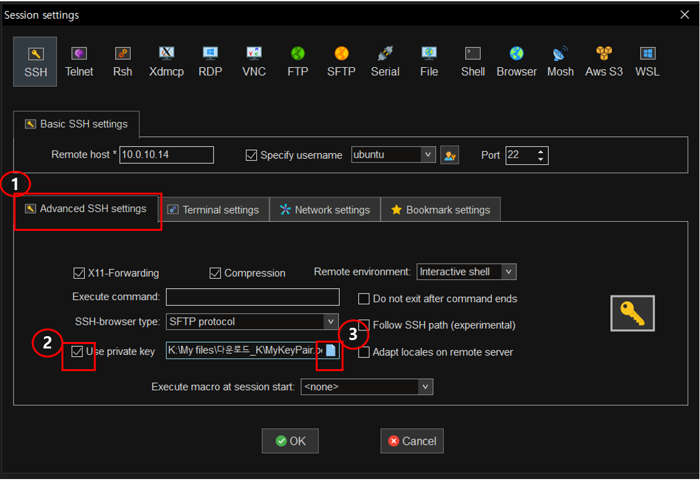

<br>


5. ① `Network setting` 탭 클릭 → ② `SSH gateway(jump host)` 버튼 클릭 : admin Server 접속을 위해서는 bastion server를 통해야 하기 때문에 jump host에 Bastion Server 정보 등록이 필요하다.

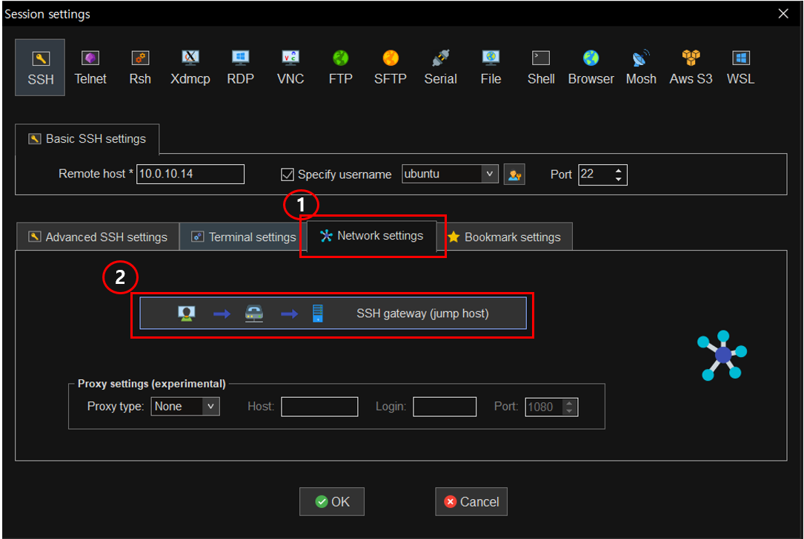

<br>

6. ① jump host 정보 입력 → ② `OK` 버튼 클릭한다.

➕ Gateway host : 메모한 📌 **Bastion Server의 Public IP** 입력

➕ Username : `ubuntu` 입력

➕ Port : `10022` 입력

➕ Use SSH key : 이전에 다운받은 pem 파일(MyKeyPair.pem) 등록

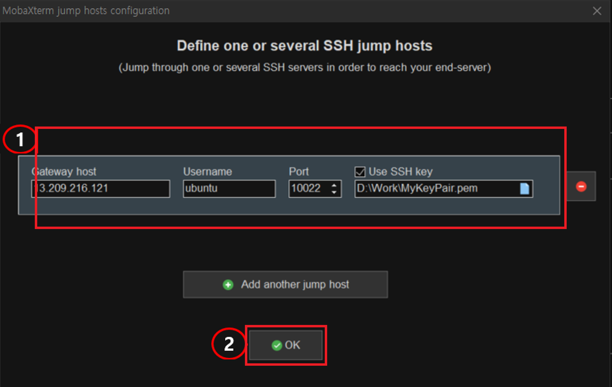

<br>

7. 다시 한 번 `OK` 버튼 클릭하여 입력정보을 최종 저장한다.

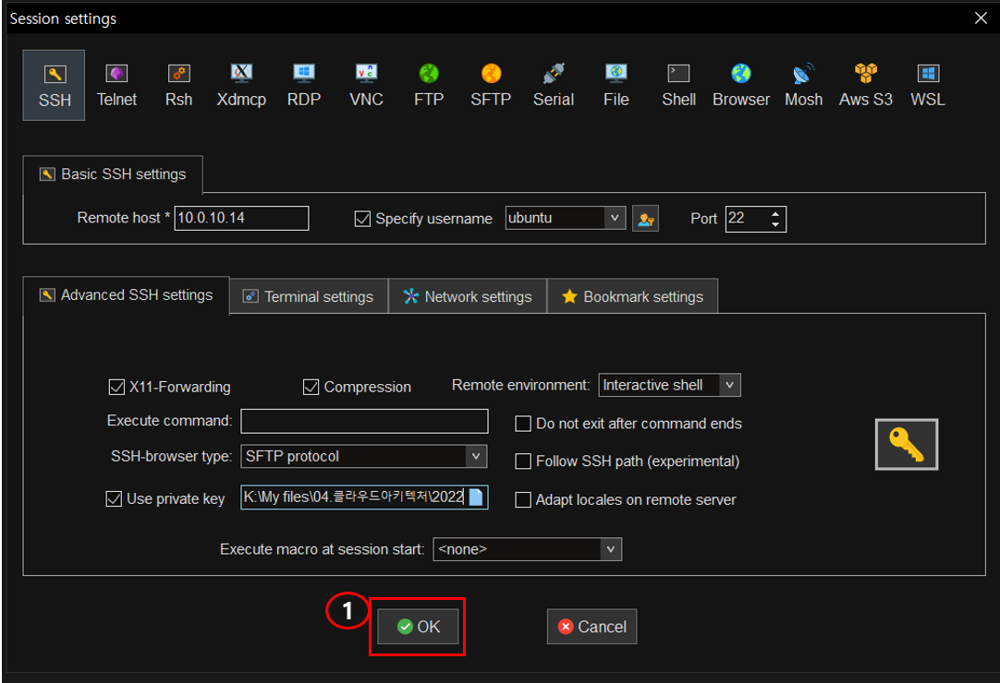

<br>

8. 정상적으로 admin_server가 접속되는지 확인한다.

- 접속화면에 `ubuntu@ip-10-0-1-208:~$` 형식의 프롬프트가 보이면 정상적으로 접속된 것이다. IP 정보는 각자 메모한 📌 **admin_server > Private IP**와 동일해야 한다.

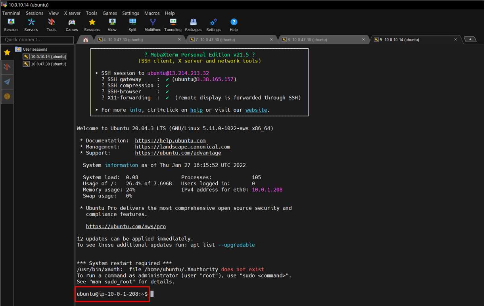

<br>

---
